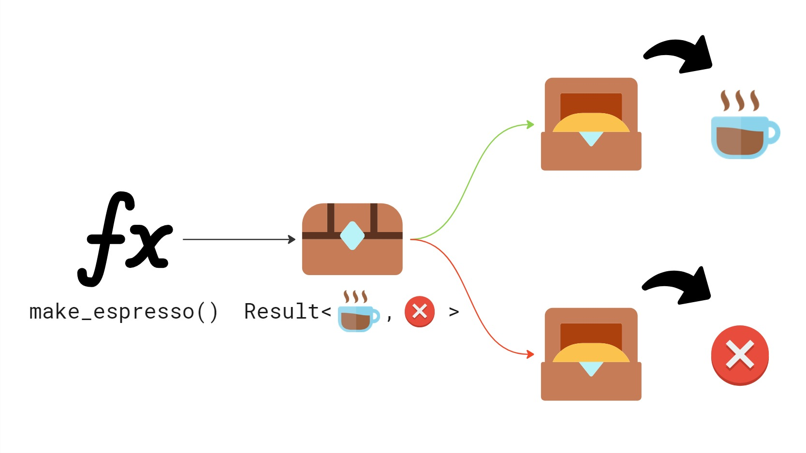
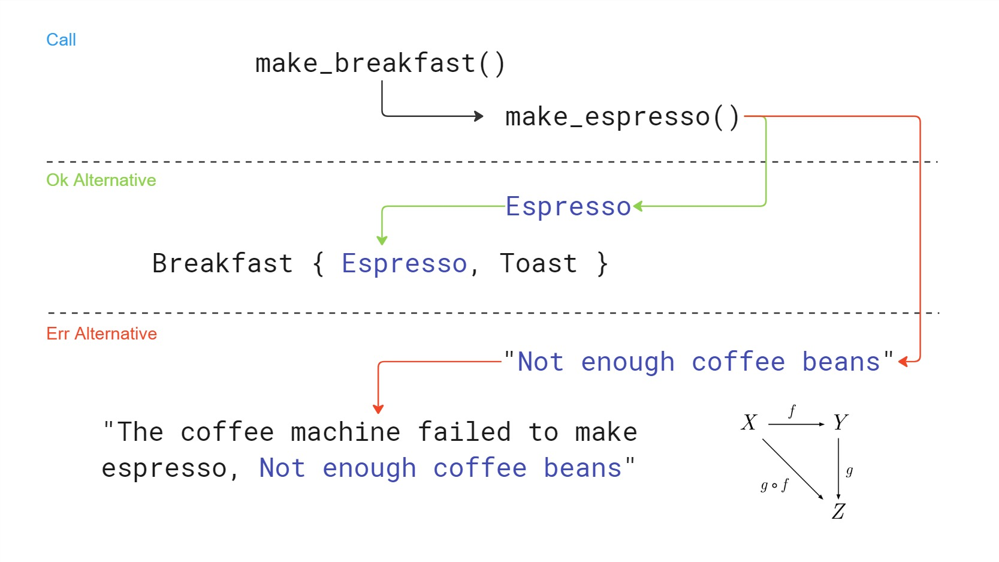
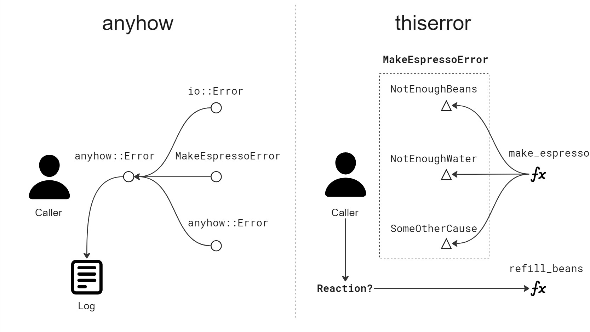

<!-- _footer: "" -->


---

# Error Handling in Rust

---

<!-- _footer: in/marek-psenka -->


Marek Pšenka

- Technical Lead at Edhouse
- 7 years of experience
- Worked with C++, C# for the most of my career
- Been using Rust for the last 2 years

---

<!-- paginate: true -->

```rust
pub struct CoffeeMachine {
    water_tank_volume: f64,
    available_coffee_beans: f64,
}

impl CoffeeMachine {
    pub fn make_espresso(&self) -> Result<Espresso, String> {
        if self.water_tank_volume < 25.0 {
            Err("Not enough water in tank".to_string())
        } else if self.available_coffee_beans < 7.0 {
            Err("Not enough coffee beans".to_string())
        } else {
            Ok(Espresso {})
        }
    }
}
```

---

```rust
    #[test]
    fn error_returned_when_making_espresso_without_beans() {
        let machine = CoffeeMachine {
            water_tank_volume: 300.0,
            available_coffee_beans: 2.0,
        };

        let result = machine.make_espresso();
        assert!(result.is_err());
        assert_eq!(result, Err("Not enough coffee beans".to_string()));
    }

    #[test]
    fn espresso_is_made_with_water_and_beans() {
        let machine = CoffeeMachine {
            water_tank_volume: 300.0,
            available_coffee_beans: 7.0,
        };

        let result = machine.make_espresso();
        assert!(result.is_ok());
    }
```

---



---

## Philosophy

The idea of making space for error information in function return value is not new

```C
int main(void)
{
    FILE *f = fopen("non_existent", "r");
    if (f == NULL) {
        perror("fopen() failed");
    } else {
        fclose(f);
    }
}
```

```text
fopen() failed: No such file or directory
```

---

## Rust makes it really easy

```rust
pub enum Result<T, E> {
    Ok(T),
    Err(E),
}
```

```rust
fn open_nonexistent_file() {
    match std::fs::File::open("non_existent") {
        Ok(file) => drop(file),
        Err(err) => println!("open() failed: {}", err),
    }
}
```

```text
open() failed: The system cannot find the file specified. (os error 2)
```

---

## Side-by-side

```C
int main(void)
{
    FILE *f = fopen("non_existent", "r");
    if (f == NULL) {
        perror("fopen() failed");
    } else {
        fclose(f);
    }
}
```

```rust
fn open_nonexistent_file() {
    match std::fs::File::open("non_existent") {
        Ok(file) => drop(file),
        Err(err) => println!("open() failed: {}", err),
    }
}
```

---

## Composing to make breakfast

```rust
pub struct Breakfast {
    pub espresso: Espresso,
    pub toast: Toast,
}

pub fn make_breakfast(coffee_machine: CoffeeMachine) -> Result<Breakfast, String> {
    match coffee_machine.make_espresso() {
        Ok(espresso) => Ok(Breakfast {
            espresso,
            toast: Toast {},
        }),
        Err(coffee_machine_err_str) => Err(format!(
            "The coffee machine failed to make espresso, {}",
            coffee_machine_err_str
        )),
    }
}
```

---



---

## Composability is useful

Is `String` a desirable error type? It is composable but DIY:

```rust
        Err(coffee_machine_err_str) => Err(format!(
            "The coffee machine failed to make espresso, {}",
            coffee_machine_err_str
        )),
```

What about the standard library?

```rust
pub trait Error: Debug + Display {
    fn source(&self) -> Option<&(dyn Error + 'static)> { ... }
    fn provide<'a>(&'a self, request: &mut Request<'a>) { ... }
}
```

---

## Building composable error types

1. Implement `std::error:Error` trait yourself
2. Adopt a general-purpose error type from a crate like `anyhow`
3. Use a crate like `thiserror` to auto-implement `std::error:Error`

There is no _right strategy_, you should pick what suits your code

---

```rust
use thiserror::Error;

#[derive(PartialEq, Debug, Error)]
pub enum MakeEspressoError {
    #[error("Not enough water in tank")]
    NotEnoughWater,
    #[error("Not enough coffee beans")]
    NotEnoughBeans,
}

impl CoffeeMachine {
    pub fn make_espresso(&self) -> Result<Espresso, MakeEspressoError> {
        if self.water_tank_volume < 25.0 {
            Err(MakeEspressoError::NotEnoughWater)
        } else if self.available_coffee_beans < 7.0 {
            Err(MakeEspressoError::NotEnoughBeans)
        } else {
            Ok(Espresso {})
        }
    }
}
```

---

```rust
#[derive(PartialEq, Debug, Error)]
pub enum MakeBreakfastError {
    #[error("Unable to make espresso, {0}")]
    UnableToMakeEspresso(#[from] MakeEspressoError),
    #[error("Unable to make toast")]
    UnableToMakeToast,
}

pub fn make_breakfast(coffee_machine: CoffeeMachine) -> Result<Breakfast, MakeBreakfastError> {
    Ok(Breakfast {
        espresso: coffee_machine.make_espresso()?,
        toast: Toast {},
    })
}
```

- `thiserror` macros take care of `std::error::Error` implementation and composability. _Warning_: Consider potential breach of encapsulation.
- The question mark `?` operator simplifies code and improves readability

---

```rust
    #[test]
    fn error_returned_when_making_breakfast_without_beans() {
        let coffee_machine = CoffeeMachine {
            water_tank_volume: 300.0,
            available_coffee_beans: 2.0,
        };

        let result = make_breakfast(coffee_machine);
        assert!(result.is_err());
        assert_eq!(
            result,
            Err(MakeBreakfastError::UnableToMakeEspresso(
                MakeEspressoError::NotEnoughBeans
            ))
        );

        println!("{}", result.unwrap_err());
    }
```

```text
Unable to make espresso, Not enough coffee beans
```

---

```rust
use anyhow::{anyhow, Context, Result};

impl CoffeeMachine {
    pub fn make_espresso(&self) -> Result<Espresso> {
        if self.water_tank_volume < 25.0 {
            Err(anyhow!("Not enough water in tank"))
        } else if self.available_coffee_beans < 7.0 {
            Err(anyhow!("Not enough coffee beans"))
        } else {
            Ok(Espresso {})
        }
    }
}
```

---

```rust
pub fn make_breakfast(coffee_machine: CoffeeMachine) -> Result<Breakfast> {
    let espresso = coffee_machine
        .make_espresso()
        .context("Unable to make espresso")?;

    Ok(Breakfast {
        espresso,
        toast: Toast {},
    })
}
```

- Question mark operator `?` again in action
- `anyhow::context` is used to provide context for the inner error and compose error information.

---

```rust
    #[test]
    fn error_returned_when_making_breakfast_without_beans() {
        let coffee_machine = CoffeeMachine {
            water_tank_volume: 300.0,
            available_coffee_beans: 2.0,
        };

        let result = make_breakfast(coffee_machine);
        assert!(result.is_err());

        let err = result.unwrap_err();
        for inner in err.chain() {
            println!("{inner}");
        }
    }
```

```text
Unable to make espresso
Not enough coffee beans
```

---



---

## Summary

- Idea of making space for error information in return value is not new
- Rust makes it easy with `Result<T, E>`
- Think about composability in error types, is it useful to you?
- Use `anyhow` as a quick start
- `anyhow` is mostly suitable for application code
- If caller needs to match on different causes, use `thiserror`
- Use `thiserror` in libraries, but you might also consider defining your own type